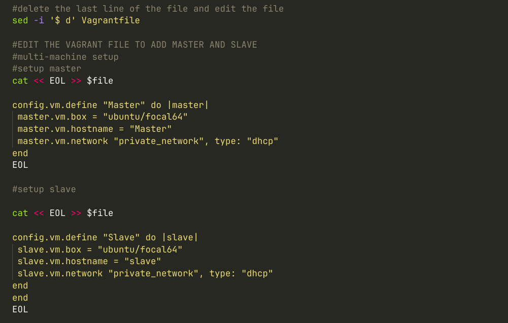
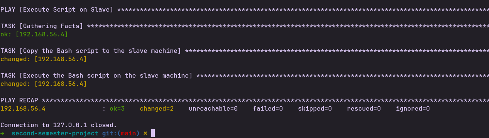
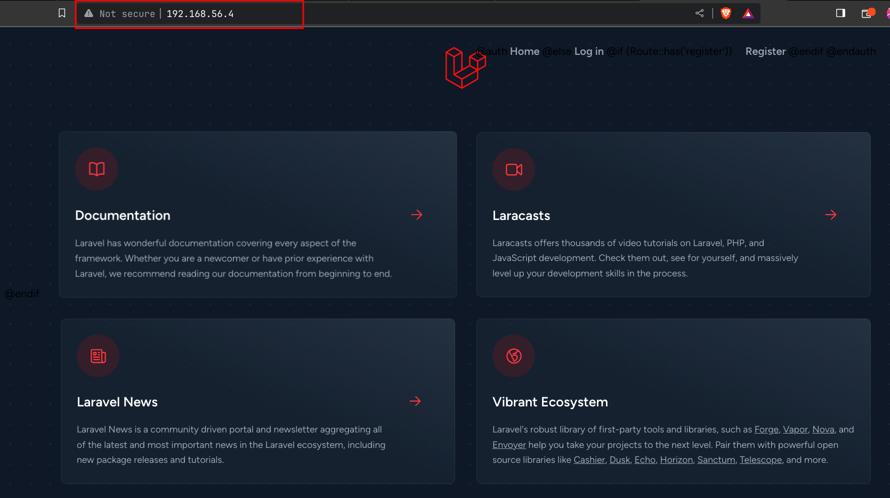

# Provisioning of two Ubuntu-based servers, named “Master” and “Slave”, using Vagrant, for the deployment of a PHP application.

First step to take is to create the directory where you want your script to run and cd into that directory, then create a file to store your script for example vagrant.sh.

I used automate.sh

Open the file with a text editor (nano or vim)

This is where your automatic deployment setup will be done

initialize a vagrant environment to pull a vagrantfile by running vagrant init

# Machine Configuration

The screenshot above shows the slave and master vagrant machine configuration.
I am using dynamic network type dhcp so my IP is dynamic and because it is dynamic I catch the value and store it in a variable called slave_ip

as at the time of running my code below is the slave machine details

## Slave

Hostname: slave

IP Address: 192.168.56.4

**The screenshot above is the final response for automate.sh script**

**Using this IP Address above one can access the installed laravel application hosted on the apache server on the slave machin**e.

